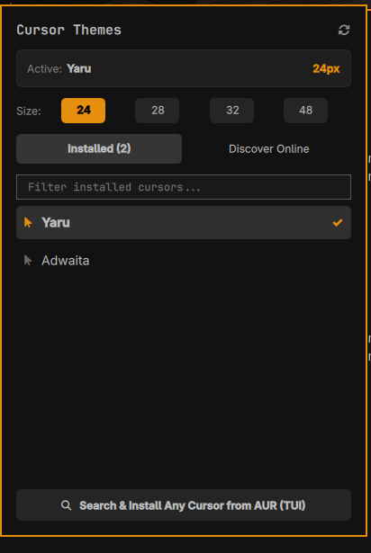

# Omarchy Cursor 🖱️

A modern cursor theme manager and status bar widget for [Omarchy Linux](https://omarchy.org/).

Browse, discover, download, and switch cursor themes seamlessly across **Hyprland**, **GTK 3/4**, and **XWayland** with instant live session switching and configuration persistence.



---

## Features

- **Omarchy Top Bar Widget:** Quick-glance status bar icon displaying your active cursor theme and size.
- **Interactive Popup Panel:**
  - View locally installed cursor themes and click to switch live without restarting apps.
  - Switch cursor sizes quickly (`24px`, `28px`, `32px`, `48px`).
  - Curated discovery catalog of top community cursor themes with 1-click installation.
  - Live search filter to quickly find installed cursors.
- **Unified 4-Point System Synchronization:**
  - **Hyprland Compositor:** Live reload via `hyprctl setcursor`.
  - **Hyprland Config:** Manages environment variables in `~/.config/hypr/hyprland.lua` and startup in `autostart.lua`.
  - **GTK Applications:** Updates `gsettings` and GTK 3 / GTK 4 `settings.ini`.
  - **XWayland Fallback:** Updates `~/.icons/default/index.theme`.
- **Full-Featured CLI (`omarchy-cursor`):**
  - Run in terminal, custom keybindings, or user scripts.
  - Interactive TUI switcher using `gum` or `fzf`.
  - Search across Arch and AUR repositories for cursor packages.

---

## Install

Install and enable the plugin directly using the Omarchy CLI:

```sh
omarchy plugin add https://github.com/muhamm-ad-ahmad/omarchy-cursor.git --enable
```

---

## Usage

- Click the cursor icon in the top bar to toggle the details panel.
- Click any installed theme to switch to it immediately.
- Click a size button (`24`, `28`, `32`, `48`) to adjust the cursor scale.
- Switch to the **Discover Online** tab to install popular themes with one click.
- Keyboard shortcuts:
  - **Escape**: Close the panel.
  - **Tab / Shift+Tab**: Switch focus between adjacent bar popouts.

---

## Configure

Move the widget to your preferred bar section (e.g. `left`, `center`, or `right`):

```sh
omarchy bar move io.github.muhamm-ad-ahmad.omarchy-cursor --section right
```

---

## CLI Usage

The bundled CLI tool `bin/omarchy-cursor` works standalone and is bundled inside the plugin.

To use `omarchy-cursor` globally from anywhere in your shell, optionally symlink it:

```sh
ln -sf ~/.config/omarchy/plugins/io.github.muhamm-ad-ahmad.omarchy-cursor/bin/omarchy-cursor ~/.local/bin/omarchy-cursor
```

### Commands

```sh
# Show current active theme and size
omarchy-cursor current

# List all locally installed cursor themes
omarchy-cursor list

# Apply a theme and size across Hyprland, GTK, and XWayland
omarchy-cursor set breeze_cursors 24

# Open interactive TUI theme switcher
omarchy-cursor switch

# Browse curated online themes and install from AUR
omarchy-cursor browse

# Search Arch and AUR repositories for cursor packages
omarchy-cursor search "catppuccin"

# Install a specific cursor package
omarchy-cursor install bibata-cursor-theme
```

---

## Curated Cursor Themes Catalog

The plugin includes one-click installation support for popular community cursor packs:

- **Bibata Modern** (`bibata-cursor-theme`)
- **Catppuccin Mocha** (`catppuccin-cursors-mocha`)
- **Breeze & BreezeX** (`breeze-cursors`, `breezex-cursor-theme`)
- **Capitaine** (`capitaine-cursors`)
- **Nordzy** (`nordzy-cursors`)
- **Posy's Cursors** (`posy-improved-cursors`)
- **Volantes** (`volantes-cursors`)
- **Apple Cursor** (`apple_cursor`)
- **Oreo Cursors** (`oreo-cursors-git`)
- **Material Cursors** (`material-cursors-git`)
- **Phinger Cursors** (`phinger-cursors`)

---

## Dependencies

- **Hyprland** (`hyprctl`): For live compositor cursor updates and reload
- **GLib / GNOME** (`gsettings`): For GTK 3 & GTK 4 cursor configuration
- **Package Manager**: `omarchy pkg aur add`, `yay`, or `pacman` (for installing optional cursor packages)
- **Gum** (optional): For interactive prompts in terminal TUI mode

---

## Remove

To disable and remove the plugin from Omarchy:

```sh
omarchy plugin remove io.github.muhamm-ad-ahmad.omarchy-cursor
```

---

## License

[MIT](LICENSE) © 2026 Muhammad Ahmad
